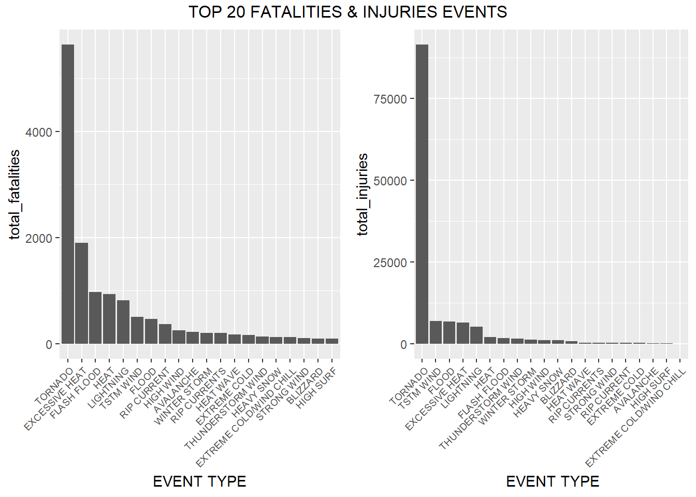
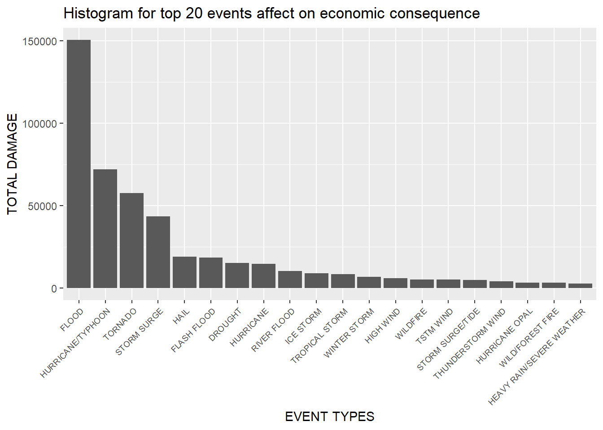
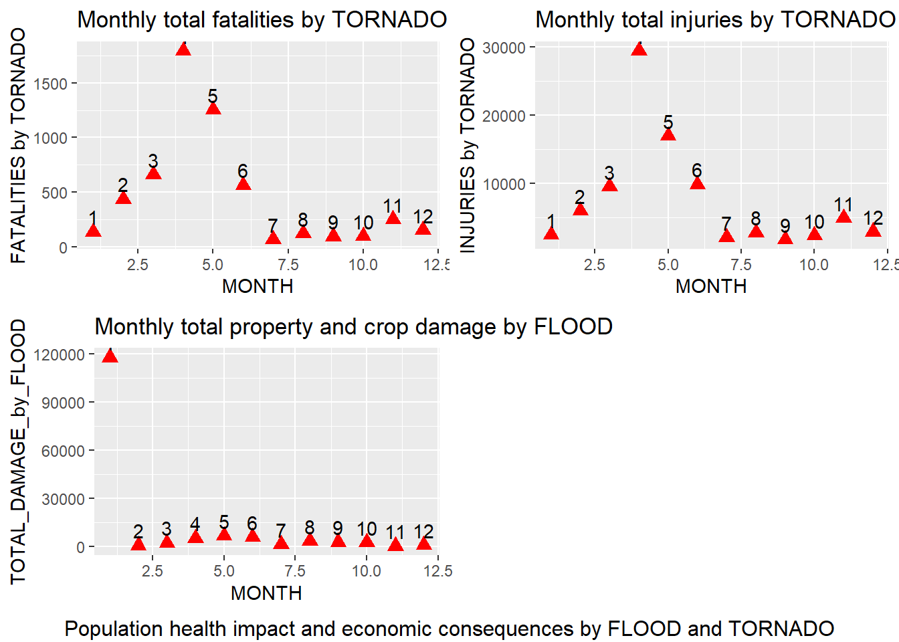

## **Synopsis** ##  
##### The U.S. National Oceanic and Atmospheric Administration's (NOAA) storm database tracks characteristics of major storms and weather events in the United States, including when and where they occur, as well as estimates of any fatalities, injuries, and property damage.  #####
##### We use the dataset to analyze which types of events are most harmful to population health and which types have the greatest economic consequences. We can see two major events, "TORNADO"; with respect to population health, and "FLOOD"; on the economic consequences, have the highest side effects significantly.  #####
##### We also make more in depth analysis on the data, which states in United States suffered the most on these two events and which months of the year are the worst. We find out "TORNADO" affects in the states "Alabama", "Taxes" and "Mississippi", and "FLOOD" affects in the states "California" most. Most of the "TORNADO" are happening in the month of "April" and "FLOOD" in "January" of the years.  #####
##### By making preventive measures of the diasters focusing on the events "FLOOD" and "TORNADO" which are occuring in "January" and "April" respectively, in the highest affected states, we can reduce both economic consequences and harmful population health in advance.  #####


## **Data Processing** ##  
##### **Download the file from the given URL of the course website and extract files** #####  


```r
if (!file.exists("repdata_data_StormData.csv.bz2")){
    download.file("https://d396qusza40orc.cloudfront.net/repdata%2Fdata%2FStormData.csv.bz2", "repdata_data_StormData.csv.bz2")
    print("invalidating")}
```

##### **Read csv.bz2 file & store in object "data"** #####  


```r
data <- read.csv("repdata_data_StormData.csv.bz2", sep = ",")
```

##### **Load libraries** #####  


```r
library(ggplot2)
library(dplyr)
library(tidyr)
library(gridExtra)
```

##### **Structure of data** #####  


```r
str(data)
```

```
## 'data.frame':	902297 obs. of  37 variables:
##  $ STATE__   : num  1 1 1 1 1 1 1 1 1 1 ...
##  $ BGN_DATE  : chr  "4/18/1950 0:00:00" "4/18/1950 0:00:00" "2/20/1951 0:00:00" "6/8/1951 0:00:00" ...
##  $ BGN_TIME  : chr  "0130" "0145" "1600" "0900" ...
##  $ TIME_ZONE : chr  "CST" "CST" "CST" "CST" ...
##  $ COUNTY    : num  97 3 57 89 43 77 9 123 125 57 ...
##  $ COUNTYNAME: chr  "MOBILE" "BALDWIN" "FAYETTE" "MADISON" ...
##  $ STATE     : chr  "AL" "AL" "AL" "AL" ...
##  $ EVTYPE    : chr  "TORNADO" "TORNADO" "TORNADO" "TORNADO" ...
##  $ BGN_RANGE : num  0 0 0 0 0 0 0 0 0 0 ...
##  $ BGN_AZI   : chr  "" "" "" "" ...
##  $ BGN_LOCATI: chr  "" "" "" "" ...
##  $ END_DATE  : chr  "" "" "" "" ...
##  $ END_TIME  : chr  "" "" "" "" ...
##  $ COUNTY_END: num  0 0 0 0 0 0 0 0 0 0 ...
##  $ COUNTYENDN: logi  NA NA NA NA NA NA ...
##  $ END_RANGE : num  0 0 0 0 0 0 0 0 0 0 ...
##  $ END_AZI   : chr  "" "" "" "" ...
##  $ END_LOCATI: chr  "" "" "" "" ...
##  $ LENGTH    : num  14 2 0.1 0 0 1.5 1.5 0 3.3 2.3 ...
##  $ WIDTH     : num  100 150 123 100 150 177 33 33 100 100 ...
##  $ F         : int  3 2 2 2 2 2 2 1 3 3 ...
##  $ MAG       : num  0 0 0 0 0 0 0 0 0 0 ...
##  $ FATALITIES: num  0 0 0 0 0 0 0 0 1 0 ...
##  $ INJURIES  : num  15 0 2 2 2 6 1 0 14 0 ...
##  $ PROPDMG   : num  25 2.5 25 2.5 2.5 2.5 2.5 2.5 25 25 ...
##  $ PROPDMGEXP: chr  "K" "K" "K" "K" ...
##  $ CROPDMG   : num  0 0 0 0 0 0 0 0 0 0 ...
##  $ CROPDMGEXP: chr  "" "" "" "" ...
##  $ WFO       : chr  "" "" "" "" ...
##  $ STATEOFFIC: chr  "" "" "" "" ...
##  $ ZONENAMES : chr  "" "" "" "" ...
##  $ LATITUDE  : num  3040 3042 3340 3458 3412 ...
##  $ LONGITUDE : num  8812 8755 8742 8626 8642 ...
##  $ LATITUDE_E: num  3051 0 0 0 0 ...
##  $ LONGITUDE_: num  8806 0 0 0 0 ...
##  $ REMARKS   : chr  "" "" "" "" ...
##  $ REFNUM    : num  1 2 3 4 5 6 7 8 9 10 ...
```

_We look for the structure of the dataset exploring from the U.S. National Oceanic and Atmospheric Administration's (NOAA) storm database, which consists of 902297 observations in 37 variables._  
_We will mainly focus on the outcomes like fatalities, injuries, property and crop damages due to different event types._  


##### **Duplicate original dataset "data" to "mod_data" and add "MONTH" column to mod_data** #####  
##### **Find the levels of factor from "PROPDMGEXP" and "CROPDMGEXP"** #####  


```r
mod_data <- data

mod_data$MONTH <- as.numeric(format(as.Date(mod_data$BGN_DATE, format = "%m/%d/%Y %H:%M:%S"),"%m"))

unique(mod_data$PROPDMGEXP)
```

```
##  [1] "K" "M" ""  "B" "m" "+" "0" "5" "6" "?" "4" "2" "3" "h" "7" "H" "-" "1" "8"
```

```r
unique(mod_data$CROPDMGEXP)
```

```
## [1] ""  "M" "K" "m" "B" "?" "0" "k" "2"
```

_There are few mislabeled data from exponential data "PROPDMGEXP" and "CROPDMGEXP"._  

##### **Setup function to replace with exponential powers for PROPDMG and CROPDMG** #####  


```r
replace_data <- function(EXP_data) {
    EXP_data <- replace(EXP_data, EXP_data %in% c("" ," ", "-", "?", "+"),"0")
    EXP_data <- replace(EXP_data, EXP_data %in% c("h", "H"),"2")
    EXP_data <- replace(EXP_data, EXP_data %in% c("k", "K"),"3")
    EXP_data <- replace(EXP_data, EXP_data %in% c("m", "M"),"6")
    EXP_data <- replace(EXP_data, EXP_data %in% c("b", "B"),"9")
    EXP_data
}
```

_We create a function to replace the following mislabeled and missing data from the two variables._  
1. "", " ", "-", "?", "+" -> "0" (zero exponential)  
2. "h", "H" -> "2" (square)  
3. "k", "K" -> "3" (kilo)  
4. "m", "M" -> "6" (million)  
5. "b", "B" -> "9" (billion)  

##### **Replaced with correct exponential values** #####  


```r
mod_data$PROPDMGEXP <- replace_data(mod_data$PROPDMGEXP)
mod_data$CROPDMGEXP <- replace_data(mod_data$CROPDMGEXP)

unique(mod_data$PROPDMGEXP)
```

```
##  [1] "3" "6" "0" "9" "5" "4" "2" "7" "1" "8"
```

```r
unique(mod_data$CROPDMGEXP)
```

```
## [1] "0" "6" "3" "9" "2"
```

_After replacing with the correct exponential values, we checked whether there is missing or invalid data remaining in the dataset._  

##### **Types of events that are most harmful with respect to population health** #####  


```r
pop_health <- mod_data %>%
    select(STATE, EVTYPE, FATALITIES, INJURIES) %>% 
    group_by(EVTYPE) %>% 
    summarise(total_fatalities = sum(FATALITIES), total_injuries = sum(INJURIES)) %>% 
    arrange(desc(total_fatalities), desc(total_injuries))
pop_health
```

```
## # A tibble: 985 x 3
##    EVTYPE         total_fatalities total_injuries
##    <chr>                     <dbl>          <dbl>
##  1 TORNADO                    5633          91346
##  2 EXCESSIVE HEAT             1903           6525
##  3 FLASH FLOOD                 978           1777
##  4 HEAT                        937           2100
##  5 LIGHTNING                   816           5230
##  6 TSTM WIND                   504           6957
##  7 FLOOD                       470           6789
##  8 RIP CURRENT                 368            232
##  9 HIGH WIND                   248           1137
## 10 AVALANCHE                   224            170
## # ... with 975 more rows
```
_Firstly, we explore the event types which bring the highest fatalities and injuries to the population._  
_We find out that "TORNADO" is the most disastrous event that is harmful to the population health._  

##### **Calculate total property damage(million) by different event types** #####  


```r
total_dmg <- mod_data %>%
    transmute(MONTH, STATE, EVTYPE, PROPDMG = (PROPDMG * 10^as.numeric(PROPDMGEXP)),
              CROPDMG = CROPDMG * 10^as.numeric(CROPDMGEXP)) %>% 
    mutate(TOTAL_DMG_in_Million = (PROPDMG + CROPDMG)/1000000)
```

_Secondly, we calculate the sum of the total property and crop damages, then turn the measured unit into "Million"._  

## **Results** ##  

##### **Economic consequences (property damage, crop damage) with related to event types** #####  


```r
eco_conseq <- total_dmg %>%
    group_by(EVTYPE) %>%
    summarise(TOTAL_DMG_by_EVTYPE = sum(TOTAL_DMG_in_Million)) %>%
    arrange(desc(TOTAL_DMG_by_EVTYPE))
head(eco_conseq, 20)
```

```
## # A tibble: 20 x 2
##    EVTYPE                    TOTAL_DMG_by_EVTYPE
##    <chr>                                   <dbl>
##  1 FLOOD                                 150320.
##  2 HURRICANE/TYPHOON                      71914.
##  3 TORNADO                                57362.
##  4 STORM SURGE                            43324.
##  5 HAIL                                   18761.
##  6 FLASH FLOOD                            18244.
##  7 DROUGHT                                15019.
##  8 HURRICANE                              14610.
##  9 RIVER FLOOD                            10148.
## 10 ICE STORM                               8967.
## 11 TROPICAL STORM                          8382.
## 12 WINTER STORM                            6715.
## 13 HIGH WIND                               5909.
## 14 WILDFIRE                                5061.
## 15 TSTM WIND                               5039.
## 16 STORM SURGE/TIDE                        4642.
## 17 THUNDERSTORM WIND                       3898.
## 18 HURRICANE OPAL                          3192.
## 19 WILD/FOREST FIRE                        3109.
## 20 HEAVY RAIN/SEVERE WEATHER               2500
```

_We arrange the total damage in descending order and the result shows that "FLOOD" is the first major cause of property and crop damage._  

##### **Histogram for top 20 Types of events which are harmful to population health**  #####  


```r
top_20_HARMFUL_HEALTH <- head(pop_health, 20)

fatalities_plot <- ggplot(top_20_HARMFUL_HEALTH, aes(reorder(EVTYPE, -total_fatalities), total_fatalities)) + geom_col() + theme(axis.text.x = element_text(angle = 45, size = 7, hjust = 1)) + xlab("EVENT TYPE")

injuries_plot <- ggplot(top_20_HARMFUL_HEALTH, aes(reorder(EVTYPE, -total_injuries), total_injuries)) + geom_col() + theme(axis.text.x = element_text(angle = 45, size = 7, hjust = 1)) + xlab(" EVENT TYPE")

grid.arrange(fatalities_plot, injuries_plot, ncol = 2, top = "TOP 20 FATALITIES & INJURIES EVENTS")
```

<!-- -->

_The above figure is plotting of the fatalities and injuries against different events._  
_We will see "TORNADO" as a top event followed by "EXCESSIVE HEAT", "FLOOD", "TSTM WIND" and so on._  

##### **Histogram for top 20 Types of events which have the greatest economic consequences** #####  


```r
top_20_dmg <- head(eco_conseq, 20)

ggplot(top_20_dmg, aes(x = reorder(EVTYPE, -TOTAL_DMG_by_EVTYPE), y = TOTAL_DMG_by_EVTYPE)) + geom_col() + theme(axis.text.x = element_text(angle = 45, hjust = 1, size = 7)) + xlab("EVENT TYPES") + ylab("TOTAL DAMAGE") + ggtitle("Histogram for top 20 events affect on economic consequence")
```

<!-- -->

_Similarly, on plotting the total damage of property and crop against different events, we will see "FLOOD" followed by "HARRICANE/TYPHOON", "TORNADO" as top events in the chart._  

##### **Find out which state's economy was mostly affected by FLOOD** #####  


```r
FLOOD <- total_dmg %>%
    filter(EVTYPE == "FLOOD") %>% 
    group_by(STATE)

FLOOD_BY_STATE <- FLOOD %>%
    summarise(TOTAL_DAMAGE = sum(TOTAL_DMG_in_Million)) %>% 
    arrange(desc(TOTAL_DAMAGE))
FLOOD_BY_STATE
```

```
## # A tibble: 55 x 2
##    STATE TOTAL_DAMAGE
##    <chr>        <dbl>
##  1 CA         117378.
##  2 TN           4250.
##  3 ND           3990.
##  4 IA           2970.
##  5 NJ           2112.
##  6 FL           1824.
##  7 IN           1547.
##  8 MN           1398.
##  9 NY           1329.
## 10 VT           1112.
## # ... with 45 more rows
```

_Filtering only the event "FLOOD" in different states, we realize that "CA", "California State" has the highest damage which is almost 3 times higher than its successor._  

##### **Find out which month of the year's economy was the worst impact by FLOOD** #####  


```r
FLOOD_BY_MONTH <- FLOOD %>% 
    group_by(MONTH) %>% 
    summarise(TOTAL_DAMAGE_by_FLOOD = sum(TOTAL_DMG_in_Million)) %>% 
    arrange(desc(TOTAL_DAMAGE_by_FLOOD))
FLOOD_BY_MONTH
```

```
## # A tibble: 12 x 2
##    MONTH TOTAL_DAMAGE_by_FLOOD
##    <dbl>                 <dbl>
##  1     1               117784.
##  2     5                 6664.
##  3     6                 5853.
##  4     4                 5271.
##  5     8                 3391.
##  6     9                 2861.
##  7    10                 2618.
##  8     3                 2374.
##  9     7                 1410.
## 10    12                  941.
## 11     2                  779.
## 12    11                  374.
```

_We again look for which month of the year is the biggest impact to economic damages by "FLOOD"._  
_We find out "JANUARY" is the month of highest economic damage in the year across the United States._  

##### **Find out which state's population health was the most harmful affected by TORNADO** #####  


```r
TORNADO_BY_STATE <- mod_data %>% 
    filter(EVTYPE == "TORNADO") %>% 
    group_by(STATE) %>% 
    summarise(TOTAL_FATALITIES = sum(FATALITIES), TOTAL_INJURIES = sum(INJURIES)) %>% 
    arrange(desc(TOTAL_FATALITIES))
TORNADO_BY_STATE
```

```
## # A tibble: 52 x 3
##    STATE TOTAL_FATALITIES TOTAL_INJURIES
##    <chr>            <dbl>          <dbl>
##  1 AL                 617           7929
##  2 TX                 538           8207
##  3 MS                 450           6244
##  4 MO                 388           4330
##  5 AR                 379           5116
##  6 TN                 368           4748
##  7 OK                 296           4829
##  8 IN                 252           4224
##  9 MI                 243           3362
## 10 KS                 236           2721
## # ... with 42 more rows
```

_Like we did in the economic damage filters, we also look for highest harmful health caused by "TORNADO"._  
_"Alabama State" followed by "Taxes State", "Mississippi State" are top 3 states affected by "TORNADO"._  

##### **Find out which month of the year' population health was the worst impact by TORNADO** #####  


```r
TORNADO_BY_MONTH <- mod_data %>% 
    filter(EVTYPE == "TORNADO") %>% 
    group_by(MONTH) %>% 
    summarise(TOTAL_FATALITIES = sum(FATALITIES), TOTAL_INJURIES = sum(INJURIES)) %>% 
    arrange(desc(TOTAL_FATALITIES))
TORNADO_BY_MONTH
```

```
## # A tibble: 12 x 3
##    MONTH TOTAL_FATALITIES TOTAL_INJURIES
##    <dbl>            <dbl>          <dbl>
##  1     4             1793          29439
##  2     5             1253          17003
##  3     3              662           9559
##  4     6              565           9868
##  5     2              436           6027
##  6    11              251           4946
##  7    12              154           2928
##  8     1              137           2479
##  9     8              121           2804
## 10    10               99           2382
## 11     9               95           1799
## 12     7               67           2112
```

_"March", "April" and "May" are the time when "TORNADO" sweeps through the United States._  

##### **Plotting the comparison of the most disastrous events, TORNADO and FLOOD occured monthly** #####    


```r
ECO_MONTH_PLOT <- ggplot(FLOOD_BY_MONTH, aes(x = MONTH, y = TOTAL_DAMAGE_by_FLOOD)) + geom_point(size = 3, colour = "red", shape = 17) + geom_text(aes(label = MONTH, vjust = -0.5)) + ggtitle("Monthly total property and crop damage by FLOOD")

FATALITIES_MONTH_PLOT <- ggplot(TORNADO_BY_MONTH, aes(x = MONTH, y = TOTAL_FATALITIES)) + geom_point(size = 3, colour = "red", shape = 17)+ geom_text(aes(label = MONTH, vjust = -0.5)) + ylab("FATALITIES by TORNADO") + ggtitle("Monthly total fatalities by TORNADO")

INJURIES_MONTH_PLOT <- ggplot(TORNADO_BY_MONTH, aes(x = MONTH, y = TOTAL_INJURIES)) + geom_point(size = 3, colour = "red", shape = 17) + geom_text(aes(label = MONTH, vjust = -0.5)) + ylab("INJURIES by TORNADO") + ggtitle("Monthly total injuries by TORNADO")

grid.arrange(FATALITIES_MONTH_PLOT, INJURIES_MONTH_PLOT, ECO_MONTH_PLOT, ncol = 2, bottom = "Population health impact and economic consequences by FLOOD and TORNADO")    
```

<!-- -->

_From the above plot, we can comment as the month "April" is the most harmful population health caused by "TORNADO", and the month "January" is the highest economic consequences caused by "FLOOD" starting from the year 1951 to 2011 November in United States._  
